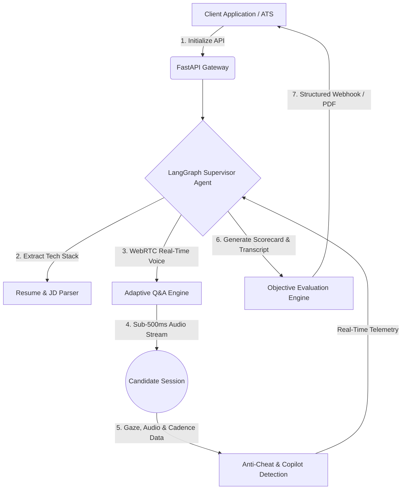

[-purple)](https://techeval.ai)

# Kovi AI Interview Agent by TechEval.ai

Kovi by techeval.ai is an autonomous AI technical interviewer tailored by seniority (Junior to Architect). Runs initial screens, deep dives, & system design with custom pass scores, tech stacks, must-ask questions, & smart proctoring. Auto-evaluates engineering talent 24/7 to scale hiring to 1,000+ screens/day with zero human fatigue.

[](https://techeval.ai)
[](https://techeval.ai)
[]()

## 🏗️ Architecture & Workflow

TechEval.ai runs on a serverless architecture (GCP Cloud Run + Vercel) paired with stateful LangGraph agents to guarantee low conversational latency, zero hallucinations, and full data compliance.



### Key Engineering Guardrails
* **Deterministic LangGraph Supervision:** Unlike simple LLM wrappers, Kovi operates under a strict supervisor-worker graph to adhere strictly to your grading rubrics without drifting off-topic or hallucinating ratings.
* **100% India-Localized Infrastructure (DPDP Ready):** All candidate voice data, video feeds, and evaluation logs are processed locally through India cloud regions (Mumbai), providing ultra-low conversational latency and complete regulatory compliance.
* **Lean Serverless Economics:** Hosted entirely on serverless compute, eliminating idle server overhead and delivering full 60-minute technical screens at a flat rate of **₹150 per interview**.
## 🚀 Core Capabilities & Configurable Parameters

| Feature | Options & Customization | Purpose |
|---|---|---|
| **JD & Resume Parsing** | Automated tech stack & project extraction | Constructs tailored, role-specific evaluation tracks based on candidate history. |
| **Interview Types** | Initial Screening, Technical Deep Dive, System Design, Behavioral, Full Stack | Matches the exact stage of your recruitment pipeline. |
| **Seniority Levels** | Junior/Foundation, Mid/Execution, Senior/Architecture | Adapts question complexity and technical depth to candidate YOE. |
| **Tailored Tech Stacks** | Fully editable (e.g., Python, LangChain, PostgreSQL) | Focuses the dialogue strictly on your production stack. |
| **Must-Ask Questions** | Editable custom prompt injections | Ensures critical compliance or role-specific questions are answered. |
| **Evaluation Controls** | Max 60 mins duration & custom Pass Score | Sets objective quantitative benchmarks (e.g., 6.5) for candidate filtering. |
| **Deadlines & Expiration** | Configurable hour deadlines (e.g., 48 Hours) | Enforces strict link-expiration rules to maintain pipeline velocity. |
| **Automated PDF Transcripts** | Raw, unedited verbatim conversation record | Provides HR and hiring managers an authentic, offline record of the candidate's spoken responses for review.
| **AI Interview Scorecards** | Quantitative technical score, Hire/No-Hire recommendation, strengths, and improvement areas | Delivers immediate, objective evaluation summaries to hiring managers for fast decision-making. |

## 🛡️ Enterprise Security & Anti-Cheat Engine

Kovi ensures the integrity of every technical evaluation through a multi-layered proctoring engine:
*   **AI Copilot Detection:** Analyzes conversational speech rhythm and injects dynamic follow-up curveballs to catch candidates reading answers generated by tools like ChatGPT. 
*   **Hardware Proctoring:** Utilizes gaze tracking, multiple face detection, and browser tab-switch logging. 
*   **Non-Blocking Evidence Capture:** If Kovi detects LLM usage, it **does not exit immediately**. It continues the interview, captures all evidence, and flags it on the HR scorecard.

## ⚙️ Automated Interview Flow & Rules

*   **Auto-Submission Engine:** Once Kovi finishes reading a question, the candidate has **12 seconds** to start answering. Once speaking begins, Kovi allows for a **7-second pause gap**. If the candidate is silent during the initial 12 seconds or pauses for more than 7 seconds mid-answer, the system automatically submits the response and advances.
*   **Session Recovery:** If a candidate experiences a network drop or low 5G signal, Kovi auto-saves the state. They can click the link to resume exactly where they left off. If a candidate disconnects more than two times, HR is automatically notified.
*   **Strict Grading Rubric:** Kovi evaluates rigorously. A highly capable candidate (e.g., a 130 IQ benchmark) typically scores a 6.5. We recommend setting pass thresholds between **6.3 and 7.5**.

## 💻 Technical Requirements

*   **Hardware:** Laptop or Desktop computer strictly required (mobile phones and tablets are blocked due to live coding requirements).
*   **Browser:** Runs natively on all major modern browsers (Chrome, Edge, Safari, Firefox). No extensions, add-ons, or downloads are required.

## 🔗 API Integration & Webhooks

You can programmatically generate interview links and receive instant scorecards upon completion.

### 1. Installation
Install the official SDK from PyPI:
```bash
pip install kovi-sdk
```

### 2. Schedule an Interview Programmatically
```python
from kovi import KoviClient

# Initialize the client with your API key
client = KoviClient(api_key="YOUR_LIVE_API_KEY_HERE")

try:
    response = client.schedule_interview(
        job_id="JD-AI-7284",
        candidate_name="Candidate Name",
        candidate_email="candidate@example.com",
        mobile_number="+91-**********",
        role="AI Engineer",
        interview_type="System Design",
        evaluation_level="Mid-Level to Senior",
        tech_stack=[
            "Python", "FastAPI", "GCP", "LangChain", 
            "PostgreSQL", "Supabase", "Pinecone"
        ],
        duration=30,
        pass_score=6.5,
        deadline_hours=72
    )
    
    print("✅ Interview Scheduled Successfully!")
    print(f"🔗 Candidate Link: {response.get('interviewUrl')}")

except Exception as e:
    print(f"❌ Failed to schedule interview: {e}")
```
### 3. Scorecard Webhook Payload
Once the interview concludes, Kovi sends a structured JSON scorecard to your ATS:

```json
{
  "candidate_id": "cnd_98765",
  "final_score": 7.2,
  "passed_threshold": true,
  "proctoring_flags": {
    "tab_switches": 0,
    "ai_copilot_detected": false,
    "disconnects": 1
  },
  "strengths": ["Database Scaling", "Microservices Architecture"],
  "weaknesses": ["CI/CD Pipeline Configuration"],
  "transcript_url": "[https://techeval.ai/dash/transcripts/cnd_98765](https://techeval.ai/dash/transcripts/cnd_98765)"
}
```

## 💳 Pricing & Accounts

* **Free Trial:** New accounts receive **10 free credits** upon sign-up.
* **Standard Pricing:** **₹150 per interview credit**. 
* **Usage:** One credit equals one complete interview, regardless of the interview's duration (up to the 60-minute maximum).
* **Account Limits:** Registration is restricted to one user account per specific company branch. Multiple users from the same company can register if they are assigned to different regional branches/locations.

## 📞 Support

* **Sales & Custom ATS Integrations:** contact@techeval.ai
* **Technical Support:** support@techeval.ai
